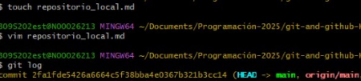

# Como crear un repositorio remoto

Ve al sitio web de GitHub e inicia sesión.

Haz clic en "Nuevo repositorio".

Escribe el nombre que tendrá el repositorio.

Añade una descripción si lo deseas.

Elige si quieres que sea público o privado.

No selecciones la opción de crear un README automáticamente.

Haz clic en "Crear repositorio".

Crea una carpeta en tu computador donde guardarás tu proyecto.

Abre esa carpeta con Git Bash o una terminal.

Inicia el control de versiones con Git.

Agrega los archivos que quieras incluir en el proyecto.

Guarda los cambios en una primera versión.

Copia la dirección del repositorio que creaste en GitHub.

Usa esa dirección para decirle a tu repositorio local dónde está su repositorio remoto.

Envía el contenido de tu carpeta local al repositorio de GitHub.

Marca la rama principal como la predeterminada para trabajar.

Cuando hagas cambios en tu proyecto, guárdalos localmente y luego súbelos a GitHub.

Si hiciste cambios en GitHub o desde otro computador, puedes traerlos a tu carpeta local para que todo esté actualizado.

